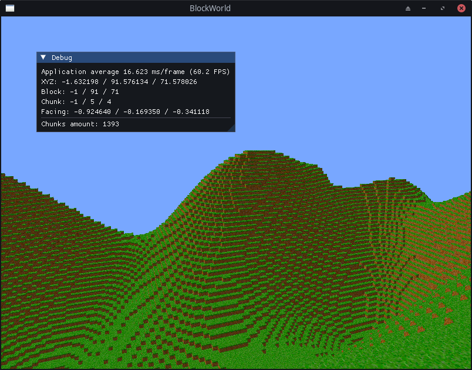

# Voxel Engine

Small Minecraft-like block world created in free time as hobby project using C++ and OpenGL.
The project is currently on hold, however I'm planning to come back here.
 
## Features
- Procedural world generation
- Movable camera
- Textures
- Chunk generation using perlin noise
- Face culling

